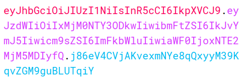
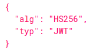
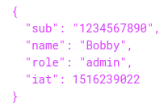
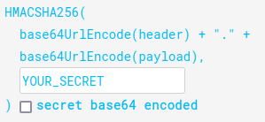

# JWT (JSON Web Token)

## What is a JWT ?

JWT's are a standardized format for sending cryptographically signed JSON data between systems (i.e.: sending data from frontend to backend and vice versa)

Can contain any kind of data but mostly used to send information (claims) about a user - all this being par of othe authentication process, session handling and access control mechanisms.

All data a server needs to trust the token is stored in the token itself, which makes JWT a popular choince for highly distributed websites where users need to interact with multiple backends

## JWT Format

A JWT consists of 3 parts:
- a header
- a payload
- a signature

They are each separated by a dot



### Header

The header contains the information about the enctyption algorithm and the token type



There are multiple algorithms available to encrypt your data

### Payload

The payload contains the "claims" about the user



This information is available to anyone that "decodes" the payload, so storing unencrypted sensitive information in the payload is absolutely forbidden

### Signature

The signature of the JWT happens by the server hashing the header, aswell as a secret signing key, and without knowing that key it shouldn't be possible to generate the correct signature for a given header and payload



## Attacks

### Nature of attacks

JWT attacks involve a user sending modified JWT's to the server in order to achieve a malicious goal. Due to the nature of the technology, that goal is most of the time to bypass authentication and gain access control by impersonating another user

### Impact of attacks

The impact of a stolen or tampered JWT are severe. If an attacker is able to gain access to a valid token, they will be able to escalate their privileges or impersonate users, taking full control of their accounts

### Rise of attacks

JWT vulnerabilities typically arise due to flawed handling of the tokens withing the application. JWT is very flaxible by design, allowing developers to implement a great deal of details themselves, making it easy for unexperienced devs to introduce unwanted vulnerabilites

Usually, those implementation flaws mean that the signature of the token isn't defined and/or verified proprely, enabling an attacker to tamper with the values passed to the application via the payload

Even with a robust verification workflow, wether the token can be trusted relies havily on the server's secret key remaining a secret. If the key is leaked, guessed or bruteforced, an attacked will be able to generate valid signatures for the token, compromising the entire system

## Brute-forcing secret keys

Some singing algorithms use an arbitrary, standalone string as the secret key. (like a password or passphrase)
It's crucial that this secret can't be easily guessed or brute-forced. Otherwise, they may be able to create JWT's with any header and payload they like, thus allowing them to sign on into your app with valid and elevated credentials

### Brute-forcing a JWT using hashcat

Using hashcat, we can try to bruteforce the secret key of a token, we'll use a [wordlist of well-known secrets](https://github.com/wallarm/jwt-secrets/blob/master/jwt.secrets.list) and run the following command:

```bash
hashcat -a 0 -m 16500 <jwt_to_crack> <wordlist>
```

Hashcat will sign the header and payload from the JWT using each secret and it will compare the resulting signature with the original one. If any signature match, hashcat will output the identified secret in a `<jwt>:<secret>` format

### Other attacks

See many other attack types in the [PortSwigger post about JWT security](https://portswigger.net/web-security/jwt)


## Attack prevention

There are several high level measures to take to avoid attacks:
- Using an up to date library for handling JWT's and make sure the developer in charge of setting them up fully understands how it works. Modern libraries make it harder to inadvertedly implement JWT's unsecurely but they aren't foolproof.
- Make sure to perform robust signature verification on any tokens that your receive, and account for edge cases such as JWT's signed with unexpected algorithms
- Enforce a strict whitelist of permitted hosts for the `jku` header
- Make sure that you're not vulnerable to path traversal or SQL injections via the `kid` header
- Always set experiation date for tokens you issue
- Avoid sending tokens in URL parameters
- Enable the issuing server to revoke tokens


## Sources

[PortSwigger's blogpost about JWT security](https://portswigger.net/web-security/jwt)

[jwt.io online tool](https://jwt.io/)

[Pentester Academy's blogpost about bruteforcing JWT's](https://blog.pentesteracademy.com/hacking-jwt-tokens-bruteforcing-weak-signing-key-hashcat-7dba165e905e)


